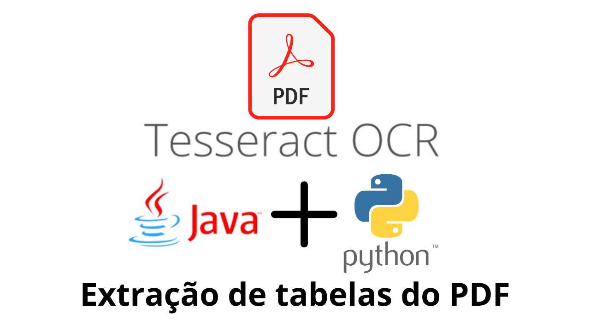

<h1 align="center"> 
  Extracao de tabela arquivo pdf 
</h1>

    

<h1 align="center">
   O que será usado aqui neste estudo.
</h1>

1 - Ide eclipse sts. 
2 - Java 17. 
3 - lombok. 
4 - Spring boot 3.4.5. 
5 - Python script

# Um exemplo simples de como extrair dados do PDF.
